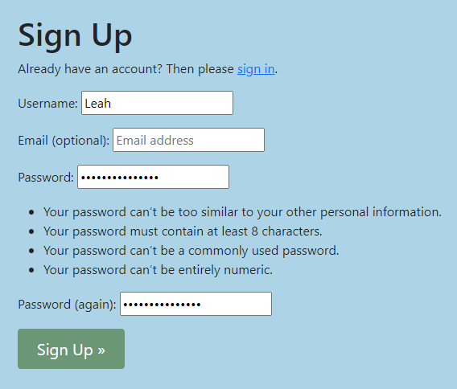
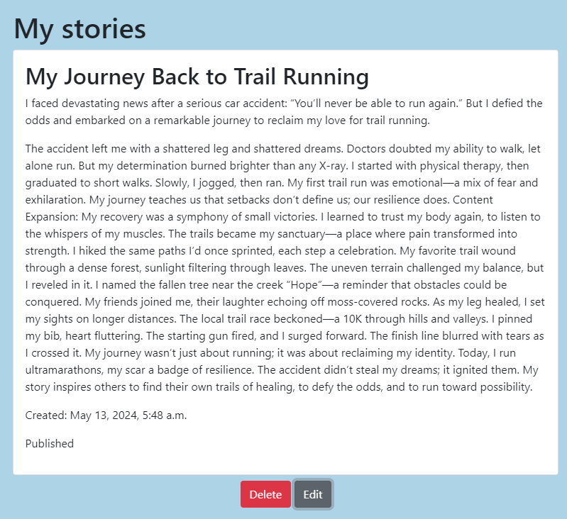

# Running Stories - Introduction

Running Stories is a platform for runners to share their unique experiences, inspire one another, and build community. This is a Full Stack website built using the Django framework with full CRUD functionality. Users can share their stories and comment on others’ stories, expressing their passion for running.

View the full website [here](https://running-stories-252b86d688ca.herokuapp.com/).

## Table of Content

- [Running Stories - Introduction](#running-stories---introduction)
- [Table of Content](#table-of-content)
- [User Experience - UX](#user-experience---ux)
    - [User Stories](#user-stories)
    - [Project Planning](#project-planning)
        - [Agile Methodologies](#agile-methodologies)
            - [Kanban Board](#kanban-board)
            - [MoSCoW Prioritization](#moscow-prioritization)
            - [Milestones](#milstones)
            - [Epics](#epics)
            - [User Storeis in GitHub](#user-stories-in-github)
    - [Design](#design)
        - [Wireframes](#wireframes)
        - [Colour Scheme](#colour-scheme)
        - [Entity Relationsship Diagrams (ERD)](#entity-relationship-diagrams-erd)
- [Features](#features)
    - [Hompe Page](#home-page)
    - [View full story](#view-full-story)
    - [The About page](#the-about-page)
    - [Register](#register)
    - [Sign In](#sign-in)
    - [Comment on a Story](#comment-on-a-story)
    - [Edit and Delete Comments](#edit-and-delete-comments)
    - [Create a Running Story](#create-a-running-story)
    - [Edit and Delete a Running Story](#edit-and-delete-a-running-story)
    - [Navigate and Logout](#navigate-and-logout)
- [Technologies Used](#technologies-used)
    - [Languages Used](#languages-used)
    - [Database Used](#database-used)
    - [Frameworks and Libraries](#frameworks-and-libraries)
    - [Tools & Programs](#tools--programs)
- [Testing](#testing)
- [Bugs](#bugs)
- [Deployment](#deployment)
- [Credits](#credits)
    - [Code Used](#code-used)
    - [Inspiration](#inspiration)
    - [Acknowledgements](#acknowledgements)   

## User Experience - UX

### User Stories

1. User Registration - As a new user, I want to register on the website so that I can create and share my running stories.
    
    AC1 - Given that I am on the registration page, when I provide valid details (username, email, password), then I should be successfully registered.

    AC2 - Given that I am on the registration page, when I provide invalid or incomplete details, then I should receive an error message indicating the issue.

2. Create a Running Story - As a registered user, I want to create a running story to share my experiences.

    AC1 - Given that I am logged in, when I navigate to the “Share Story” page, then I should see a form to input my story details (title, content).

    AC2 - Given that I have filled in the story details, when I submit the form, then my story should be saved and visible to other users.

3. View Running Stories - As a user, I want to view running stories posted by others so that I can get inspired of other runners.

    AC1 - Given that I am on the homepage, then I should see a list of running stories with titles and brief summaries.

    AC2 - Given that I click on a story, then I should be taken to the full story page.

4. Comment on Running Stories - As a user, I want to leave comments on running stories.

    AC1 - Given that I am logged in, when I read a story, then I should see a comment section.

    AC2 - Given that I enter a comment and submit it, then my comment should be visible to others.

5. Edit and Delete Stories - As a story creator, I want to edit or delete my own stories so that I can change or delete the content I posted.

    AC1 - Given that I am logged in and viewing my own story, then I should see options to edit or delete it.

    AC2 - Given that I choose to edit, when I make changes and save, then the story should be updated.
    
    AC3 - Given that I choose to delete, when I confirm, then the story should be removed.

6. Ask Questions - As a runner, I want to ask questions about running so that I can learn from others.
    
    AC1 - The user can access a form or input field where they can type their running-related question.
    
    AC2 - Upon submitting the question, it is stored in the database.
    
    AC3 - The question appears on the website’s question feed or list.
    
    AC4 - The user receives a confirmation message after submitting the question.
    
    AC5 - The question form includes validation to prevent empty or invalid submissions.

7. Answer Questions - As a runner, I want to answer questions from fellow runners to share my knowledge and experiences.
    
    AC1 - The user can view a list of existing questions on the website.

    AC2 - Each question displays the question text and relevant details (e.g., date posted, author).

    AC3 - The user can click on a question to view its details and any existing answers.
    
    AC4 - The user can submit an answer to a specific question.
    
    AC5 - After submitting an answer, it appears alongside the question.
    
    AC6 - The answer form includes validation to prevent empty or invalid submissions.

8. View Questions and Answers - As a user, I want to see questions and answers related to running on the website so that I can participate in discussions.

    AC1 - The website homepage or a dedicated “Questions” section displays a list of recent questions.
    
    AC2 - Each question shows the question text, author, and the number of answers.
    
    AC3 - The user can click on a question to view its details and answers.
    
    AC4 - Answers are displayed below the question, sorted by date (most recent first).
    
    AC5 - The website provides pagination or infinite scrolling for long lists of questions.

9. Visitor View Running Stories - As a visitor, I want to be able to read running stories so that I can be inspired by others’ experiences.
    
    AC1 - When I visit the website, I should see a list of running stories.
    
    AC2 - I should be able to click on a story to read its full content.

10. View My Stories - As a user, I want to be able to view my running stories on a single page so that I can easily track my progress and share my experiences with others.
    
    AC1 - The “My Stories” section should list all the running stories associated with my account.
    
    AC2 - If I haven’t posted any running stories yet, the section should display a message indicating that there are no stories available.
    
    AC3 - When I create a new running story, it should appear immediately in the “My Running Stories” section.
    
    AC4 - The running stories should be sorted in reverse chronological order (most recent first).

11. The About Page - As a website visitor, I want to understand the purpose of the running stories website so that I can engage with the content effectively.
    
    AC1 - The “About” page prominently displays a brief overview of the website’s purpose.
    
    AC2 - The content is written in plain language, avoiding technical jargon.
    
    AC3 - The “About” page provides a link or button to explore more running stories.
    
    AC4 - The page layout is visually appealing and easy to read.

12. Edit and Delete Comments - As a comment creator, I want to be able to edit or delete my own comments so that I can change or delete the content I posted.
    
    AC1 - Given that I am logged in and viewing my own comment, then I should see options to edit or delete it.
    
    AC2 - Given that I choose to edit, when I make changes and save, then the comment should be updated.
    
    AC3 - Given that I choose to delete, when I confirm, then the comment should be removed.

13. Handle Drafts - As a user, I want to be able to save my stories as drafts so that I can work on them later.
    
    AC1 - Users should be able to save their stories as drafts.
    
    AC2 - When editing a story, users should have the option to publish it.
    
    AC3 - The system should provide a way to view all published stories.
    
    AC4 - There should be a way to identify stories that are still in draft mode.

### Project planning

#### Agile Methodologies 

##### Kanban Board

I have used the [project board in Git Hub](https://github.com/users/SofiaNords/projects/5/views/1) for my project planning. It has helped me to get an overview of the project and to see the progress. Thanks to the MoSCoW method (see below), I realized quite early in the project that User Story 6, 7 and 8 would not be included in this release. 

One of my strategies in this project has been to first focus on functionality and then spend time on design, as it is easy for time to run out when I am working on design. Therefore, I chose to add a special column called “Ready for Design” as the last step before testing.

##### MoSCoW Prioritization

The User Stories are labeled with one of the following categories according to the MoSCoW prioritization method:

- Must Have: Requirements that are absolutely necessary for the product to function. These have the highest priority.

- Should Have: Important requirements that should be included if possible, but they are not critical.

- Could Have: Desirable requirements that can be added if time and resources allow.

- Won’t Have (this time): Requirements that will not be included in the current version of the product.

##### Milstones

I also wanted to try using Milstones in Github Projects but realize now in retrospect that for a project of this size, a Kanban Board with User Stories and MoSCoW labels were enough.

##### Epics

Even Epics felt a bit over-ambitious in this project but it has been educational to use it.

##### User Stories in GitHub

You can access User Stories in Git Hub [here](https://github.com/SofiaNords/running-stories/issues). In the picture below you can see how I have labeled the User Stories with Epics, MoSCoW Prioritization and Milstones.

### Design

#### Wireframes

#### Colour Scheme

I captured the following colours from the hero image and used the blue one for the background and the green one for the buttons. 

#### Entity Relationship Diagrams (ERD)

When I initially planned this project, I also intended to include a Questions and Answers section as you can see from the user stories. Therefore there are also models for Questions and Answers in my ERDs. 

The models that actually was created are the ones below. I realized during the project that the About model is redundant but I decided to keep it as it is part of my learning journey. 

## Features

### Home Page

- The hero image welcomes the page visitor with a runner running in an inspiring environment.
- The page visitors has direct access to the Running Stories below the hero image where they can read a excerpt that will give them a brief summary of the story. 
- The visitor can click on an optional story and access the complete story.

### View full Story

- A page visitor can view the full story and comments related to the story.
- The page visitor can see that you have to log in to be able to leave a comment.

### The About page

- A page visitor or user can read about the website's purpose and get instructions in how to get started sharing stories and or leave comments on others stories.

### Register

- A page visitor can click on Register in the navigation menu and fill out the Sign up form.

### Sign in

- A registered user can sign in by filling in the Sign in form.

### Comment on a Story

- A logged-in user can leave a comment on a story.

### Edit and Delete Comments

- A logged-in user can edit or delete their own comments.

### Create a Running Story

- A logged-in user can create a Running Story on the Share Story page. The user can create a draft that is only visible for that user under My Stories. When the user changes status to Published the story will become visible on the Home Page.

### Edit and Delete a Running Story

- A logged-in user can edit or delete a story they have created themselves.

### Navigate and Logout

- A user can easily navigate on the website using the navigation menu.
- A logged-in user can logout by clicking on the Logout link in the navigation menu and then confirm to Sign Out. 

## Technologies Used

### Languages Used

- [Python](https://en.wikipedia.org/wiki/Python_(programming_language))
- [HTML5](https://en.wikipedia.org/wiki/HTML5)
- [CSS3](https://en.wikipedia.org/wiki/CSS)
- [JavaScript](https://en.wikipedia.org/wiki/JavaScript)

### Database Used

- [PostgreSQL](https://dbs.ci-dbs.net/manage/) - Used to store the data

### Frameworks, Libraries, Tools & Programs

- [Balsamiq](https://balsamiq.cloud/) - Used to create wireframes
- [Bootstrap](https://getbootstrap.com/docs/5.0/getting-started/introduction/) - Used to design the website and make it responsive
- [Crispy Bootstrap](https://pypi.org/project/crispy-bootstrap5/) - Used to create and style forms
- [Django](https://www.djangoproject.com/) - Used for rapid, reusable and secure development
- [Django allauth](https://docs.allauth.org/) - Used for account registration and authentication
- [Django Crispy Forms](https://django-crispy-forms.readthedocs.io/) - Used to control the rendering behavior of my Django forms in a elegant and DRY way
- [dj-database-url](https://pypi.org/project/dj-database-url/) - Used to configure the application and define the database connection in an url
- [Django Summernote](https://pypi.org/project/django-summernote/) - Used as a editor in Admin
- [Git](https://git-scm.com/) - Used for version control
- [GitHub](https://github.com/) - Used to store the code
- [GitPod](https://www.gitpod.io/) - Used as the IDE for development
- [Heroku](https://dashboard.heroku.com/) - Used to deploy the project
- [Font Awesome](https://fontawesome.com/) - Used for social media icons
- [Gunicorn](https://docs.djangoproject.com/en/4.2/howto/deployment/wsgi/gunicorn/) - Used as the Web Server to run Django on Heroku
- [Lucidchart](https://www.lucidchart.com/) - Used to create Entity Relationship Diagrams (ERD)
- [Psycopg](https://pypi.org/project/psycopg2/) - Used as a database adapter to support the connection to database
- [Whitenoise](https://pypi.org/project/whitenoise/) - Used to handle static files

## Testing

My test document, which you can navigate to below, consists of the following tabs:

- User Stories (Testing User Stories and their Acceptance Criterias)
- CI Python Linter (Testing Python code)
- JSHint (Testing javaScript code)
- W3C Markup Validation Service (Testing HTML code)
- W3C CSS Validation Service (Testing CSS code)
- Lighthouse (Testing performance, accessibility, progressive web apps and SEO)

View testing document [here.](https://docs.google.com/spreadsheets/d/16GrrTfA8aQ79KI6y7XLdAuZSGlR_fDgHIUbQLkWweuM/edit#gid=0)

## Bugs

I had a Runtime Error in my Terminal and discussed it with my mentor. We solved it by adding APPEND_SLASH to False in settings.py. 

Because of this I discovered another problem when I was trying to enter the admin page. I had to append a slash to get to the admin page. Tutor Assistance helped me to change the settings in urls.py where we removed the slash from the admin path.

## Deployment

The Running Stories platform is deployed on the Heroku platform and can be accessed here:
https://running-stories-252b86d688ca.herokuapp.com/

Fork the repository

1. Go to the [GitHub repository](https://github.com/SofiaNords/running-stories).

2. Click the button with FORK on it on your right hand side.

3. A new page "Create new Fork" will open, you can also edit the name if you would like.

4. At the bottom of the page - click on CREATE FORK.

5. Now you have a copy of the project in your repositories.

Clone the repository

1. Go to the [GitHub repository](https://github.com/SofiaNords/running-stories).

2. Click on the Code tab and copy the web URL.

3. Open the terminal in the code editor of your choice, and change the current working directory to the one you will use to clone the repository.

4. Type: "git clone" inte the terminal and then paste the link you copied before and press ENTER.

Create the Heroku app

1. Navigate to your Heroku dashboard and create a new app with a unique name.

2. Click on the Settings tab and reveal the config vars and add a key of DISABLE_COLLECTSTATIC and a value of 1 and click Add. This step prevents Heroku from uploading static files during the build.

Update your code for deployment

3. Install a production-ready webserver for Heroku: pip3 install gunicorn~=20.1

    and add gunicorn==20.1.0 to the requirements.txt file with: 
    pip3 freeze --local > requirements.txt

4. Create a file named Profile at the root directory of the project.

5. In the Procfile, declare this is a web process followed by the command to execute your Django project: web: gunicorn runningstories.wsgi

6. Open the runningstories/settings.py file and set DEBUG=False

7. Add ,'.herokuapp.com' to the ALLOWED_HOSTS list in settings.py

8. You can now git add the files you have modified, git commit them and push them to GitHub.

Deploy on Heroku

9. Click on the Deploy tab on Heroku dashboard.

10. In the Deployment method section enable GitHub integration by clicking on Connect to GitHub. If you have not deployed a project from GitHub before then, you will be asked to authenticate with GitHub. 

11. Choose the projects repository in the list that appears when you start typing into the search box.

12. Scroll to the bottom of the page and click Deploy Branch to start a manual deployment of the main branch.

13. Click on Open app to view your deployed project.

14. Open the Resources tab and choose an eco dyno.

Database and deployment

1. Add following in your env.py file:

    import os

    os.environ.setdefault(
        "DATABASE_URL", "<your-database-URL>")

    os.environ.setdefault("SECRET_KEY", "<your_choice_of_secret_key>")

2. Your settings.py file should look like this:

    SECRET_KEY = os.environ.get("SECRET_KEY")

3. A secret key value should be set on Heroku as a Config Var named SECRET_KEY.

Deployment with static files

1. Install and setup the Python package: pip3 install whitenoise~=5.3.0

2. Add the package to your requriements.txt file: pip3 freeze --local > requirements.txt

3. Add WhiteNoise to Django's MIDDLEWARE in the runningstories/settings.py file directly after the Django SecurityMiddleware: 'whitenoise.middleware.WhiteNoiseMiddleware',

4.  Also, in the codestar/settings.py file, add a STATIC_ROOT path: STATIC_ROOT = os.path.join(BASE_DIR, 'staticfiles')

5. Run the collectstatic command in the terminal to collect the static files into a staticfiles directory: python3 manage.py collectstatic

6. Check the Python version used in your IDE and look up the supported runtimes and copy the closest to the one used in you IDE.

7. Add a runtime.txt file to your app's root directory and add the Python version you copied from the list of supported runtimes in it. 

8. Set DEBUG to False. Git add, commit and push the code to GitHub.

9. Return to Heroku dashboard and click on the Settings tab and Reveal config vars button. Remove the DISABLE_COLLECTSTATIC key/value pair.

10. Click on the Deploy tab, scroll down, choose the main bransch and press Deploy Branch.

## Credits

### Code Used

- The structure and the code of the project was based on the "I think Therefore I Blog" walkthrough by Code Institute. 
- [How to keep your footer where it belongs?](https://www.freecodecamp.org/news/how-to-keep-your-footer-where-it-belongs-59c6aa05c59c/) by Dominic Fraser. I followed Dominics instruction for the placement of the footer.

### Inspiration

- I was inspired by Raneem Yads User Story Template for my User Stories.
- The Facebook group "Löpning - gruppen för oss om fattat att löpning är livet" ("Running - the group for us to understand that running is life") gave me the idea to the project.

### Acknowledgements

- I’d like to express my gratitude to my mentor, Spencer Barribal, for all the valuable advice and encouragement throughout the process.

- Thank you to my facilitator Kristyna Wach at Code Institute for your support and commitment.
